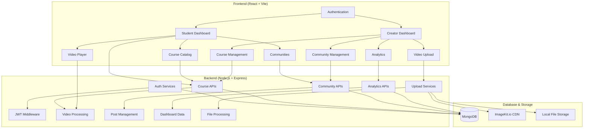

# 🎓 Gurukul Learning Platform

A modern, full-featured online learning platform that connects educators and students through courses, communities, and interactive content. Built with the MERN stack for scalability and performance.


## 🚀 Live Demo

- **Student Dashboard**: Browse courses, join communities, track progress
- **Creator Dashboard**: Manage courses, upload videos, build communities
- **Video Learning**: Stream videos with progress tracking
- **Community Features**: Posts, events, discussions

## ✨ Key Features

### 👨‍🎓 For Students
- **Course Enrollment**: Browse and enroll in published courses
- **Video Learning**: Watch course videos with progress tracking
- **Community Participation**: Join communities, participate in discussions
- **Progress Tracking**: Track course completion and learning progress
- **Dashboard**: Personalized student dashboard with analytics

### 👩‍🏫 For Creators
- **Course Management**: Create, edit, and manage courses
- **Video Upload**: Upload and organize course videos
- **Community Building**: Create and manage learning communities
- **Analytics**: Real-time statistics on enrollments, revenue, and engagement
- **Content Organization**: Structure courses with videos and resources

### 🏘️ Community Features
- **Public/Private Communities**: Create open or invitation-only communities
- **Posts & Discussions**: Rich text posts with image uploads
- **Events Management**: Schedule and manage community events
- **Member Management**: Role-based permissions and moderation

## 🏗️ System Architecture



## 💻 Tech Stack

### Frontend
- **React 18** - Modern UI library with hooks
- **Vite** - Fast build tool and dev server
- **React Router v6** - Client-side routing
- **React Query** - Server state management
- **Tailwind CSS** - Utility-first CSS framework
- **Lucide React** - Beautiful icons
- **React Hot Toast** - Toast notifications
- **Axios** - HTTP client

### Backend
- **Node.js 18+** - JavaScript runtime
- **Express.js** - Web framework
- **MongoDB** - NoSQL database
- **Mongoose** - ODM for MongoDB
- **JWT** - Authentication tokens
- **Multer** - File upload handling
- **ImageKit.io** - Image optimization CDN
- **bcryptjs** - Password hashing
- **express-validator** - Request validation

### Development Tools
- **nodemon** - Auto-restart development server
- **cors** - Cross-origin resource sharing
- **dotenv** - Environment variables
- **morgan** - HTTP request logger
- **helmet** - Security middleware

## 📱 Detailed Features

### 🔐 Authentication & Authorization
- **JWT-based Authentication**: Secure token-based auth
- **Role-based Access Control**: Student and Creator roles
- **Protected Routes**: Route-level permission controls
- **Session Management**: Auto-logout on token expiry
- **Password Security**: Bcrypt hashing

### 📚 Course Management
- **Course Creation**: Rich course creation with thumbnails
- **Video Upload**: Support for MP4, WebM, OGG formats
- **Course Editing**: Update course details, pricing, settings
- **Publication Control**: Draft/Published states
- **Enrollment System**: Student enrollment tracking
- **Progress Tracking**: Video completion tracking
- **Course Analytics**: Enrollment, revenue, rating analytics

### 🎥 Video System
- **Video Player**: Custom video player with controls
- **Progress Tracking**: Resume from last position
- **Video Management**: Edit video details, order, settings
- **Preview System**: Preview videos for non-enrolled users
- **Streaming Optimization**: Efficient video delivery

### 🏘️ Community System
- **Community Creation**: Public/private communities
- **Post Management**: Rich text posts with images
- **Event Scheduling**: Community events with RSVP
- **Member Management**: Join/leave, role management
- **Moderation Tools**: Content moderation capabilities
- **Community Analytics**: Member growth, post activity

### 📊 Analytics & Dashboards
- **Student Dashboard**: Enrolled courses, progress, communities
- **Creator Dashboard**: Course performance, revenue, students
- **Real-time Statistics**: Live data updates
- **Revenue Tracking**: Course pricing and earnings
- **Progress Analytics**: Course completion rates

### 🛠️ Admin Features
- **Content Management**: CRUD operations for all content
- **User Management**: User roles and permissions
- **File Management**: Image and video uploads
- **System Health**: Error handling and logging

## 📋 Project Structure

```
gurukul-platform/
├── backend/                  # Node.js/Express API
│   ├── controllers/         # Business logic
│   ├── models/              # MongoDB schemas
│   ├── routes/              # API endpoints
│   ├── middleware/          # Auth, validation, etc.
│   ├── config/              # Database, ImageKit config
│   ├── uploads/             # Local file storage
│   ├── .env                 # Environment variables
│   ├── package.json
│   └── server.js            # Application entry point
├── frontend/               # React Application
│   ├── src/
│   │   ├── components/      # Reusable UI components
│   │   │   ├── Auth/        # Authentication components
│   │   │   ├── Layout/      # Layout components
│   │   │   ├── UI/          # Basic UI elements
│   │   │   └── Video/       # Video player components
│   │   ├── pages/           # Page components
│   │   │   ├── Auth/        # Login, Register
│   │   │   ├── Student/     # Student pages
│   │   │   ├── Creator/     # Creator pages
│   │   │   ├── Communities/ # Community pages
│   │   │   └── Courses/     # Course pages
│   │   ├── contexts/        # React contexts
│   │   ├── services/        # API services
│   │   ├── hooks/           # Custom React hooks
│   │   └── utils/           # Utility functions
│   ├── public/              # Static assets
│   ├── package.json
│   └── vite.config.js       # Vite configuration
├── uploads/                # File uploads directory
├── API_ENDPOINTS.md        # API documentation
├── DATABASE_SCHEMA.md      # Database schema
├── DEPLOYMENT_GUIDE.md     # Deployment instructions
└── README.md               # Project documentation
```

## 🚀 Quick Start

### Prerequisites
- **Node.js** 18+ and npm
- **MongoDB** 6+ (local or MongoDB Atlas)
- **ImageKit.io** account (optional, for image optimization)

### 1. Clone the Repository
```bash
git clone <repository-url>
cd gurukul-platform
```

### 2. Backend Setup
```bash
cd backend
npm install

# Create environment file
cp .env.example .env
# Edit .env with your configuration

# Start the backend server
npm run dev
```

### 3. Frontend Setup
```bash
# Open a new terminal
cd frontend
npm install

# Start the frontend development server
npm run dev
```

### 4. Access the Application
- **Frontend**: http://localhost:3000
- **Backend API**: http://localhost:5001
- **API Health Check**: http://localhost:5001/api/health

## ⚙️ Environment Variables

### Backend (.env)
```env
# Database
MONGODB_URI=mongodb://localhost:27017/gurukul

# Authentication
JWT_SECRET=your_super_secret_jwt_key_here

# Server Configuration
PORT=5001
NODE_ENV=development

# ImageKit.io (Optional - for image optimization)
IMAGEKIT_PUBLIC_KEY=your_imagekit_public_key
IMAGEKIT_PRIVATE_KEY=your_imagekit_private_key
IMAGEKIT_URL_ENDPOINT=https://ik.imagekit.io/your_imagekit_id

# CORS (Frontend URL)
CLIENT_URL=http://localhost:3000
```

### Frontend (.env)
```env
# API Base URL
VITE_API_URL=http://localhost:5001/api

# Environment
VITE_APP_ENV=development

# Debug Logging
VITE_ENABLE_DEBUG_LOGS=true
```

## 📚 User Guide

### For Students
1. **Registration**: Sign up with student role
2. **Browse Courses**: Explore available courses in the catalog
3. **Enroll**: Click "Enroll Now" on course details page
4. **Learn**: Watch course videos and track progress
5. **Communities**: Join communities to connect with peers
6. **Dashboard**: Monitor your learning progress

### For Creators
1. **Registration**: Sign up with creator role
2. **Create Course**: Use the course creation form
3. **Upload Videos**: Add video content to courses
4. **Manage**: Edit courses, videos, and settings
5. **Build Community**: Create learning communities
6. **Analytics**: Track enrollments and revenue

## 🔗 Key API Endpoints

### Authentication
```
POST /api/auth/register    # User registration
POST /api/auth/login       # User login
GET  /api/auth/me          # Get current user
```

### Courses
```
GET  /api/courses          # Browse published courses
POST /api/courses          # Create course (Creator)
GET  /api/courses/:id      # Course details
POST /api/courses/:id/enroll # Enroll in course
```

### Communities
```
GET  /api/communities      # Browse communities
POST /api/communities      # Create community (Creator)
GET  /api/communities/me   # User's communities
POST /api/communities/:id/join # Join community
```

### Videos
```
GET  /api/videos/:id       # Video details
POST /api/videos           # Upload video (Creator)
PUT  /api/videos/:id       # Update video (Creator)
```

## 📊 Database Schema

### Key Collections
- **Users**: Authentication, roles, profiles
- **Courses**: Course information, pricing, status
- **Videos**: Video metadata, URLs, progress
- **Communities**: Community details, members
- **Posts**: Community posts and discussions
- **Events**: Community events and scheduling

*See [DATABASE_SCHEMA.md](DATABASE_SCHEMA.md) for detailed schema*

## 🚀 Deployment

### Production Deployment
1. **Database**: Set up MongoDB Atlas or self-hosted MongoDB
2. **Backend**: Deploy to Heroku, AWS, or DigitalOcean
3. **Frontend**: Deploy to Vercel, Netlify, or AWS S3
4. **CDN**: Configure ImageKit.io for image optimization
5. **Environment**: Set production environment variables

*See [DEPLOYMENT_GUIDE.md](DEPLOYMENT_GUIDE.md) for detailed instructions*

## 🛠️ Development

### Available Scripts

#### Backend
```bash
npm run dev      # Start development server with nodemon
npm start        # Start production server
npm run test     # Run tests (if configured)
```

#### Frontend
```bash
npm run dev      # Start development server
npm run build    # Build for production
npm run preview  # Preview production build
npm run lint     # Run ESLint
```

### Development Tips
- Use **MongoDB Compass** for database visualization
- Install **React Developer Tools** for debugging
- Use **Postman** or **Thunder Client** for API testing
- Enable debug logs in development environment

## 🐛 Troubleshooting

### Common Issues

**Backend won't start:**
- Check MongoDB connection
- Verify environment variables
- Ensure port 5001 is not in use

**Frontend errors:**
- Clear browser cache
- Check API URL configuration
- Verify backend is running

**File uploads failing:**
- Check file size limits
- Verify ImageKit configuration
- Ensure uploads directory exists

**Database connection issues:**
- Verify MongoDB is running
- Check connection string format
- Ensure database permissions

## 🤝 Contributing

We welcome contributions! Here's how to get started:

1. **Fork** the repository
2. **Create** a feature branch (`git checkout -b feature/amazing-feature`)
3. **Commit** your changes (`git commit -m 'Add amazing feature'`)
4. **Push** to the branch (`git push origin feature/amazing-feature`)
5. **Open** a Pull Request

### Development Guidelines
- Follow existing code style and conventions
- Write clear commit messages
- Add tests for new features
- Update documentation as needed
- Ensure all tests pass before submitting

## 📜 Documentation

- [API Documentation](API_ENDPOINTS.md)
- [Database Schema](DATABASE_SCHEMA.md)
- [Deployment Guide](DEPLOYMENT_GUIDE.md)
- [Installation Guide](INSTALLATION.md)
- [Test Scripts](TEST_SCRIPT.md)

## 📧 Support

For support and questions:
- Create an issue on GitHub
- Check existing documentation
- Review troubleshooting guide

## 📝 License

This project is licensed under the MIT License - see the [LICENSE](LICENSE) file for details.

## 🙏 Acknowledgments

- React team for the amazing framework
- MongoDB team for the excellent database
- ImageKit.io for image optimization
- All open source contributors

---

🎆 **Happy Learning with Gurukul Platform!** 🎆
